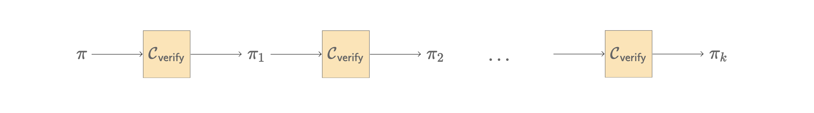
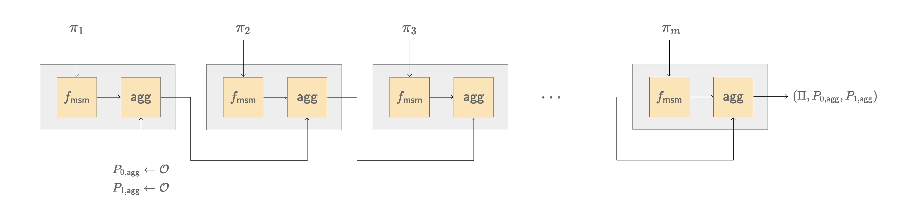
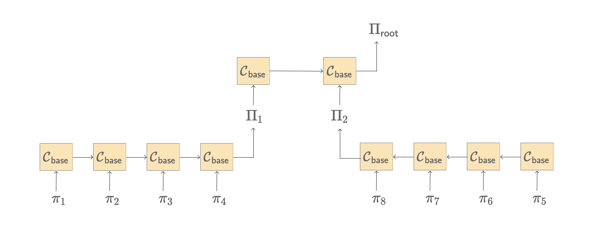

# Recursive Verification

Recursive zkSNARKs open up a new paradigm of computation on blockchains. A zkSNARK is a powerful tool that enables proving the validity of certain computation without the need for the verifier to redo the computation. In the context of Aztec, users create transaction proofs that prove that correctness of the transaction, i.e. a certain set of rules were abided by the transaction. Such a transaction proof reveals nothing about the transaction itself other than the claim that it is a valid transaction. More generally, one can create a zkSNARK proof to prove the validity of any statemtent that can be represented in an NP-complete language.

The verification of a Plonk proof requires cryptographic operations like multi-scalar multiplication (MSM) and elliptic curve pairings. Interstingly, the computation required to verify a Plonk proof can itself be represented in form of an arithmetic circuit. Suppose we have a Plonk proof $\pi$ and we represent the algorithm to verify it, i.e. $\{0,1\}\leftarrow \textsf{verify}(\pi)$ in an arithmetic circuit $\mathcal{C}_{\pi}$. The proof generated by $\mathcal{C}_{\pi}$ would attest to the fact that $\textsf{verify}(\pi) = 1$ _only_ if the original proof $\pi$ was valid. In simple words, we can verify a SNARK proof inside another SNARK proof. This is the reason why such chaining of SNARK proof verification is referred to as recursive SNARK verification.

In the figure above, we start with the initial proof $\pi$. The next proof $\pi_1$ proves that $\textsf{verify}(\pi) = 1$. Subsequently, $\pi_2$ proves that $\textsf{verify}(\pi_1) = 1$, implicitly also proving that $\textsf{verify}(\pi) = 1$, and so on. Why would we be interested in this recursive computation? Because that would allow us to compress multiple SNARK proofs in a single SNARK proof!

<!-- $$
\begin{aligned}
   \pi_1 &\leftarrow \left\{\textsf{verify}(\pi) \stackrel{?}{=} 1\right\} \\
   \pi_2 &\leftarrow \left\{\textsf{verify}(\pi_1) \stackrel{?}{=} 1\right\} \equiv \left\{\textsf{verify}\left(\left\{\textsf{verify}(\pi) \stackrel{?}{=} 1\right\}\right) \stackrel{?}{=} 1\right\} \\
   \pi_3 &\leftarrow \left\{\textsf{verify}(\pi_2) \stackrel{?}{=} 1\right\} \equiv \left\{\textsf{verify}\left(\left\{\textsf{verify}(\pi_1) \stackrel{?}{=} 1\right\}\right) \stackrel{?}{=} 1\right\} \equiv \left\{\textsf{verify}\left(\left\{\textsf{verify}\left(\left\{\textsf{verify}(\pi) \stackrel{?}{=} 1\right\}\right) \stackrel{?}{=} 1\right\}\right) \stackrel{?}{=} 1\right\}
\end{aligned}
$$ -->

### Proof Verification in Arithmetic Circuit

An UltraPlonk proof is represented as:

$$
\pi = \begin{pmatrix}
    [a]_1, [b]_1, [c]_1, [d]_1, [s]_1, [z_{\textsf{perm}}]_1, [z_{\textsf{lookup}}]_1, [t_1]_1, [t_2]_1, [t_3]_1, [t_4]_1, [W_{\mathfrak{z}}]_1, [W_{\mathfrak{z}\omega}]_1, \\
    \bar{a}, \bar{b}, \bar{c}, \bar{d}, \bar{s}_{\sigma_1}, \bar{s}_{\sigma_2}, \bar{z}_{\omega}
\end{pmatrix}
$$

We are interested in the verification algorithm of the Plonk proof $\pi$. At a high-level, the verifier work is divided in three parts:

1. Recovering challenges by correctly hashing the transcript
   $$
   \vec{c}\equiv (\textsf{init}, \eta, \beta, \gamma, \alpha, \mathfrak{z}, \nu, u) \leftarrow H(\pi),
   $$
2. Computing the evaluation of the quotient polynomial from the evaluations in the proof
   $$
   t_{\textsf{eval}} = f_{\textsf{teval}}(\pi \ | \ \vec{c}),
   $$
   where $f_{\textsf{teval}}$ is an operation performed by the verifier on the scalars in the proof $\pi$.
3. Computing the aggregated group elements:
   $$
   \begin{aligned}
   P_0 &:= f_{\textsf{msm}, 0}(\pi \ | \ \vec{c}), \\
   P_1 &:= f_{\textsf{msm}, 1}(\pi \ | \ \vec{c}),
   \end{aligned}
   $$
   where $f_{\textsf{msm}, 0}$ and $f_{\textsf{msm}, 1}$ are multi-scalar multiplication operations that the verifier needs to perform using the proof data and the computed challenges.
4. Checking the pairing equality
   $$
   e(P_0, [1]_2) \stackrel{?}{=} e(P_1, [x]_2).
   $$

If we want to verify a Plonk proof in an arithmetic circuit, we need to perform all of this computation using arithmetic gates. We refer to this circuit as the recursive verification circuit. This circuit is implemented in barretenberg in the file [`stdlib/recursion/verifier/verifier.hpp`](https://github.com/AztecProtocol/barretenberg/blob/3ce5e7e17ca7bb806373be833a44d55a8e584bda/cpp/src/aztec/stdlib/recursion/verifier/verifier.hpp). Note that we do not implement the 4th step of the verifier computation in the circuit. (We will come back to this point later.)

### Cost Analysis of Recursive Verifier Circuit

We are interested to understand how much each of the steps in the verifier computation costs in terms of arithmetic gates using TurboPlonk as well as UltraPlonk arithmetization. Here's a cost analysis of the gates used in the two proof systems for each verifier step for verifying an UltraPlonk proof $\pi$ inside the respective circuits.

$$
\begin{array}{|l|l|r|r|}
\hline \\[-8pt]
\text{No.} & \text{Description} & \text{ Ultra} & \text{ Turbo} \\[2pt] \hline \\[-8pt]
1 & \text{Recovering challenges:} \\[3pt]
& \textsf{init} = H(n, n_{\textsf{PI}}) & 2464 & 5165 \\[3pt]
& \eta = H(\textsf{init}, \textsf{PI}, [a]_1, [b]_1, [c]_1) & 4676 & 8584 \\[3pt]
& \beta, \gamma = H(\alpha, [d]_1, [s]_1, 0/1) & 3665 & 7103 \\[3pt]
& \alpha = H(\gamma, [z_{\textsf{perm}}]_1, [z_{\textsf{lookup}}]_1) & 3645 & 7088 \\[3pt]
& \mathfrak{z} = H(\alpha, [T_1]_1, [T_2]_1, [T_3]_1, [T_4]_1) & 4668 & 8796 \\[3pt]
& \nu = H(\mathfrak{z}, \bar{t}, \bar{a}, \dots) & 43199 & 87748 \\[3pt]
& u = H(\mathfrak{\nu}, [W_{\mathfrak{z}}]_1, [W_{\mathfrak{z}\omega}]_1) & 5507 & 11054 \\[3pt] \hline \\[-8pt]
2 & \text{Computing } t_{\textsf{eval}} \text{ and more:} \\[3pt]
& \text{Compute } \mathfrak{z}^n & 157 & 157 \\[3pt]
& \text{Compute } t_\textsf{eval} & 559 & 559 \\[3pt]
& \text{Lagrange evaluation } L_{n,1}(\mathfrak{z}) & 180 & 180 \\[3pt]
& \text{Miscellaneous } & 8291 & 11712 \\[3pt] \hline \\[-8pt]
3 & \text{Computing the aggregated group elements:} \\[3pt]
& \text{Check points on curve } & 2421 & 5950 \\[3pt]
& \text{MSM of large scalars } & 62824 & 181973 \\[3pt]
& \text{Compute } P_0 \ (\text{i.e. }f_{\textsf{msm}, 0}(.)) & 160258 & 443356 \\[3pt]
& \text{Compute } P_1 \ (\text{i.e. }f_{\textsf{msm}, 1}(.)) & 23732 & 74462 \\[3pt] \hline \\[-8pt]
& \text{Total:} & 326246 & 853887 \\[3pt] \hline
\end{array}
$$

Clearly, the maximum cost for verifying a Plonk proof inside a circuit is due to the multi-scalar multiplication operations as in the functions $f_{\textsf{msm}, 0}$ and $f_{\textsf{msm}, 1}$. Specifically, almost 50% of the total gate-cost goes into computing $P_0$. The next biggest cost is to compute the challenges by hashing the transcript repetitively. This means that more the number of challenges we sample, costlier the recursive verification gets.

### Aggregated Verification of Multiple Proofs

The reason why we are interested in verifying Plonk proofs in an arithmetic circuit is because it enables reducing the verification of multiple proofs to verification of a _single_ Plonk proof. Suppose we have $m$ Plonk proofs $(\pi_1, \pi_2, \dots, \pi_m)$, we can verify each of them by computing:

$$
e(P_{0,j}, [1]_2) \stackrel{?}{=} e(P_{1, j}, [x]_2) \quad \forall j \in [m],
\tag{1}
$$

where $P_{0, j} = f_{\textsf{msm}, 0}(\pi_j)$ and $P_{1, j} = f_{\textsf{msm}, 1}(\pi_j)$. The pairing check is the most expensive operation in the verification algorithm, it is almost $\approx 300\times$ more expensive than a size-$n$ multi-scalar multiplication. This is the reason why the pairing operation is not included in the recursive verification circuit as it would blow up the circuit size. Furthermore, we would like to minimise the number of pairing operations for verifying multiple Plonk proofs. The pairing check in equation $(1)$ can be re-written as:

$$
\begin{aligned}
   e(P_{0,j}, [1]_2) &= (P_{0,j} \cdot 1) * G_T \\
   e(P_{1,j}, [x]_2) &= (P_{1,j} \cdot x) * G_T
\end{aligned}
\stackrel{(1)}{\implies } P_{0,j} \stackrel{?}{=} P_{1,j}\cdot x \tag{2}
$$

where $x\in\mathbb{F}$ is the secret scalar from the trusted-setup embedded in the SRS and $G_T\in \mathbb{G}_T$ is the target group generator. Thus, the Plonk proof verification boils down to equation $(2)$, so we can write:

$$
\begin{aligned}
   P_{0,1} \stackrel{?}{=}&\ P_{1,1}\cdot x, \\
   P_{0,2} \stackrel{?}{=}&\ P_{1,2}\cdot x, \\
   \vdots&  \\
   P_{0,m} \stackrel{?}{=}&\ P_{1,m}\cdot x. \\
   \tag{3}
\end{aligned}
$$

We can combine all of these $m$ checks into a single check by using powers of a random scalar $u\in\mathbb{F}$.

$$
\begin{aligned}
   P_{0,1} + uP_{0,2} + u^2P_{0,3} + \dots + P_{0,m} &\stackrel{?}{=} (P_{1,1} + uP_{1,2} + u^2P_{1,3} + \dots + P_{0,m})\cdot x \\[3pt]
   \implies \bigg(\sum_{j\in[m]} u^{j-1}P_{0, j}\bigg) &= \bigg(\sum_{j\in[m]} u^{j-1}P_{1, j}\bigg) \cdot x \\[3pt]
   \implies P_{0,\textsf{agg}} \stackrel{?}{=}&\ P_{1,\textsf{agg}}\cdot x \\[3pt]
   \implies e(P_{0,\textsf{agg}}, [1]_2) \stackrel{?}{=}&\ e(P_{1, \textsf{agg}}, [x]_2)
\end{aligned}
$$

Therefore, if we just _aggregate_ all the $P_0$'s and $P_1$'s of the $m$ proofs, we can perform a single check to validite all $m$ proofs. This also means that, theoretically at least, we can verify _any_ number of proofs using a single pairing check. Thus, the cost to perform one pairing would be amortized across those multiple proofs, reducing the verification cost per transaction.

### Recursive Verification of Plonk Proofs

Given $m$ Plonk proofs $(\pi_1, \pi_2, \dots, \pi_m)$, we can perform recursive verification on them using a base verification circuit $\mathcal{C}_{\textsf{base}}$.

$$
\begin{aligned}
   &\mathcal{C}_{\textsf{base}}(\pi, P_{0, \textsf{prev}}, P_{1, \textsf{prev}}): \\[3pt]
   & \qquad (P_{0,\pi}, P_{1, \pi}) \leftarrow f_{\textsf{msm}}(\pi) \\
   & \qquad P_{0, \textsf{prev}} \leftarrow P_{0, \textsf{prev}} + u_\pi \cdot P_{0,\pi} \\
   & \qquad P_{1, \textsf{prev}} \leftarrow P_{1, \textsf{prev}} + u_\pi \cdot P_{1,\pi}
\end{aligned}
$$

Using $\mathcal{C}_{\textsf{base}}$, we can construct a recursive circuit $\mathcal{C}_{\textsf{recursive}}$ to verify $m$ proofs.

$$
\begin{aligned}
   & P_{0, \textsf{agg}}, P_{1, \textsf{agg}} \leftarrow \mathcal{O} \\
   &\mathcal{C}_{\textsf{recursive}}(\pi_1, \pi_2, \dots, \pi_m): \\[3pt]
   & \qquad \textsf{for }j \in [m]: \\
   & \qquad \qquad \mathcal{C}_{\textsf{base}}(\pi_j, P_{0, \textsf{agg}}, P_{1, \textsf{agg}} ) \\
   & \qquad \textsf{endfor} \\
   & \qquad \textsf{return } \big(\Pi, P_{0, \textsf{agg}}, P_{1, \textsf{agg}} \big)
\end{aligned}
$$

In the figure below, the circuit $\mathcal{C}_{\textsf{base}}$ is shown in grey boxes while the whole diagram represents the circuit $\mathcal{C}_{\textsf{recursive}}$.

Note that the final aggregated elements $P_{0, \textsf{agg}}$ and $P_{1, \textsf{agg}}$ are incorporated in the final proof $\Pi$ as its public inputs. We refer to the base proofs $\{\pi_j\}_{j\in[m]}$ as transaction proofs while rolled-up proof $\Pi$ as the tx-rollup proof. We can even recursively verify multiplie tx-rollup proofs using the same base circuit $\mathcal{C}_{\textsf{base}}$ with a slight modification:

$$
\begin{aligned}
   &\mathcal{C}_{\textsf{base}}(\pi, P_{0, \textsf{prev}}, P_{1, \textsf{prev}}): \\[3pt]
   & \qquad (P_{0,\pi}, P_{1, \pi}) \leftarrow f_{\textsf{msm}}(\pi) \\
   & \qquad (\textcolor{red}{P_{0,\textsf{PI}}}, \textcolor{red}{P_{1,\textsf{PI}}}) \leftarrow \textsf{PI}(\pi) \qquad \textcolor{yellowgreen}{\small \texttt{// extract from public inputs}} \\
   & \qquad P_{0, \textsf{prev}} \leftarrow P_{0, \textsf{prev}} + u_\pi \cdot P_{0,\pi} + \color{red}{u_\pi^2 \cdot P_{0,\textsf{PI}}} \\
   & \qquad P_{1, \textsf{prev}} \leftarrow P_{1, \textsf{prev}} + u_\pi \cdot P_{1,\pi} + \color{red}{u_\pi^2 \cdot P_{1,\textsf{PI}}}
\end{aligned}
$$

In the figure below, we show how 4 base proofs are rolled-up to compute one tx-rollup proof, and two such tx-rollup proofs are rolled up to compute one root proot $\Pi_{\textsf{root}}$.

Alternatively, one could have rolled-up all 8 base proofs to compute a single tx-rollup proof. We avoid having to roll-up a large number of proofs at reach layer of recursion for two reasons:

1. Each block of base circuit costs about 330,000 with UltraPlonk arithmetisation. Rolling up 8 base proofs would result in the recursion circuit size to be 2,640,000. Thus, more number of proofs we roll-up, larger would be the recursion circuit size.
2. In longer term, we want proofs to be rolled-up on commodity hardware and not rely on specialised machines with huge RAM and compute-power. Therefore, the recursion circuit sizes must have a practical upper bound.
